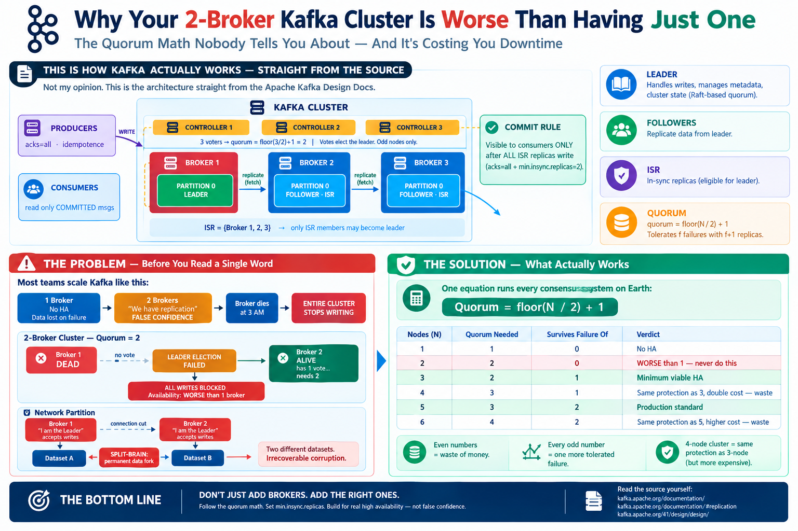
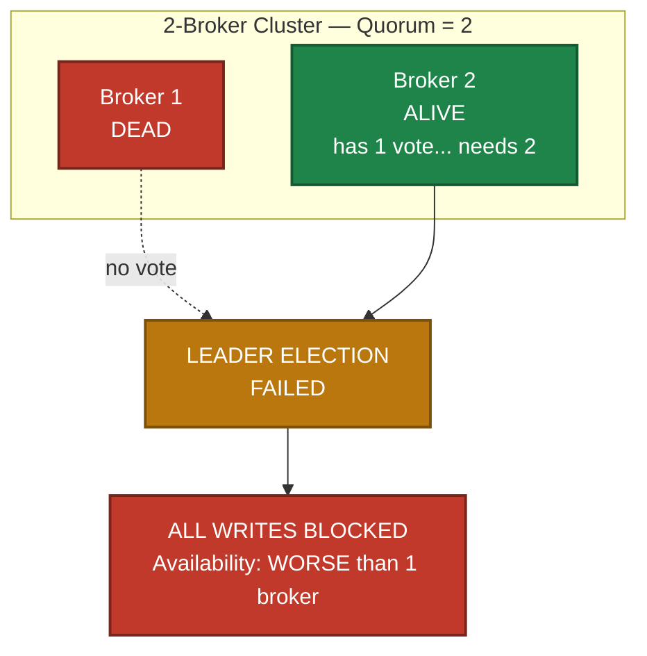
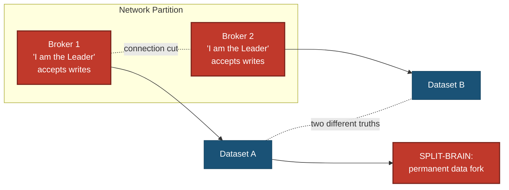
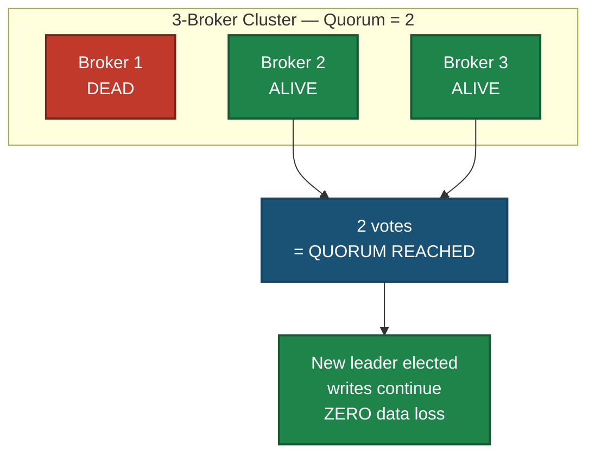
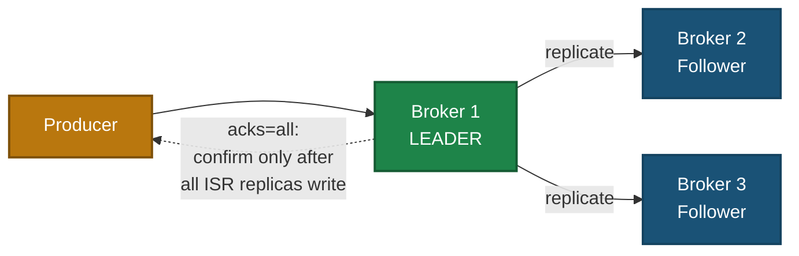
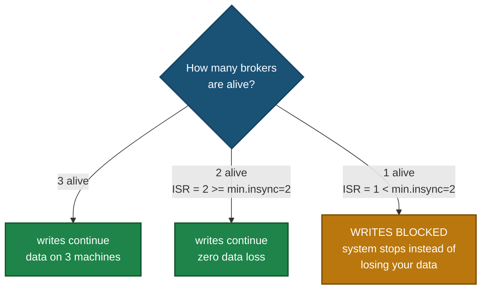
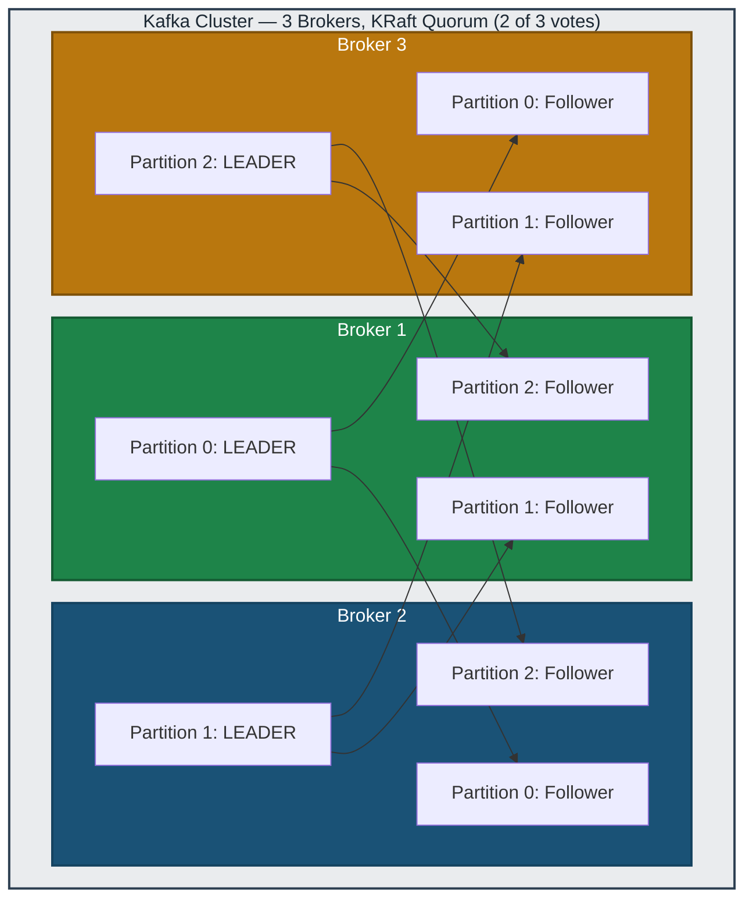

# Why Your 2-Broker Kafka Cluster Is Worse Than Having Just One

### The Quorum Math Nobody Tells You About — And It's Costing You Downtime

---

## THIS IS HOW KAFKA ACTUALLY WORKS — STRAIGHT FROM THE SOURCE



Before we tear down the 2-broker fantasy, ground yourself in reality. **This is the internal architecture of Apache Kafka --- not my interpretation** Every claim in this article traces back to the official design documentation, where the Kafka team spells out the contract verbatim: all writes go to the partition **leader**, **followers** pull and replicate the leader's log, a write is only **committed** once every **in-sync replica (ISR)** has it, and only ISR members are ever eligible for **leader election**. The same docs state the guarantee plainly: *"a committed message will not be lost, as long as there is at least one in sync replica alive, at all times."*

I don’t argue with the design documentation --- I use it to make better decisions.
Kafka’s official documentation explains how many failures the system can tolerate based on the number of replicas, and how `min.insync.replicas` helps prevent acknowledged messages from being lost.
So the approach is simple: choose the right number of nodes and configurations based on those principles.
That’s exactly what the rest of this article covers.

**Read the source yourself:**

- 📘 Official Apache Kafka Documentation — Introduction: https://kafka.apache.org/documentation/
- 🏗️ Design Chapter — Replication, Quorums & ISR: https://kafka.apache.org/documentation/#replication
- 📐 Full Design Section: https://kafka.apache.org/41/design/design/

Everything below assumes you accept one premise: **Kafka works this way by design. Fight the design and you lose data. Design with it and you sleep through outages.**

---

## THE PROBLEM — Before You Read a Single Word

Most teams scale Kafka like this:


Here is why. A 2-broker cluster needs **both** brokers alive to elect a leader:



And it gets worse. When the network hiccups instead of a full failure:



Both brokers accept writes. Two diverging datasets. **Irrecoverable corruption.**

---

## THE SOLUTION — What Actually Works

One equation runs every consensus system on Earth:

```
Quorum = floor(N / 2) + 1
```

| Nodes (N) | Quorum Needed | Survives Failure Of | Verdict |
|:---:|:---:|:---:|:---|
| 1 | 1 | 0 | No HA |
| 2 | 2 | 0 | WORSE than 1 — never do this |
| **3** | **2** | **1** | **Minimum viable HA** |
| 4 | 3 | 1 | Same protection as 3, double cost — waste |
| **5** | **3** | **2** | **Production standard** |
| 6 | 4 | 2 | Same protection as 5, higher cost — waste |

Every even number is a waste of money. Every odd number buys exactly one more tolerated failure. A 4-node cluster protects you exactly as much as a 3-node cluster.



With an odd voter count, a network partition can never satisfy quorum on both sides — one side is always forced silent. **Split-brain becomes mathematically impossible.**

---

## THE PROTECTION STACK — Quorum Guards the Brain, Replication Guards the Data

Quorum protects cluster metadata and leadership. Replication protects your actual data:



Replication alone is a half-measure. The guarantee comes from two settings working as a contract:

| Setting | Where | What It Does |
|:---|:---|:---|
| `min.insync.replicas=2` | Broker | If fewer than 2 replicas are alive and synced, REJECT all writes |
| `acks=all` | Producer | Report success only after every in-sync replica has the data |

The failure behavior:



Notice the third branch: the system chooses to stop rather than lose data. That is correct engineering.

Set `min.insync.replicas=1` and the cluster happily writes to one lonely broker — when that one dies, your acknowledged messages evaporate. Durability is a config choice. Choose wrong and your SLA is a fairy tale.

---

## THE PRODUCTION BLUEPRINT



Leaders are spread across all three brokers — no single machine becomes the bottleneck. If any one dies, every partition already has a leader waiting on another broker.

Config to copy-paste and sleep well at night:

```properties
# Broker
default.replication.factor=3
offsets.topic.replication.factor=3
min.insync.replicas=2
unclean.leader.election.enable=false

# Producer
acks=all
enable.idempotence=true
retries=2147483647
```

`unclean.leader.election.enable=false` stops Kafka from electing a data-lagging replica as leader out of desperation. Another silent-data-loss killer most teams never configure.

---

## THE GOLDEN RULE CARD

| Concept | Value | Why |
|:---|:---:|:---|
| Broker count | 3 or 5 (odd) | floor(N/2)+1 votes; even numbers waste money |
| Replication factor | 3 | 1 broker death = zero data loss |
| min.insync.replicas | RF - 1 | No write unless the safety net exists |
| Producer acks | all | Success means replicated, not just received |
| unclean.leader.election | false | Desperation is not a safety strategy |

---

## THE BOTTOM LINE

3 brokers is not a luxury. It is the cheapest way to buy real fault tolerance.

- 2 brokers = false confidence plus maximum downtime
- 4 brokers = paying double for 3-broker protection
- 3 brokers = the floor. 5 brokers = the standard. Odd, always.

Kafka does not fail because it is badly designed. It fails because someone configured it with even-numbered optimism.

Do not be that architect.

---

*If this saves your team from a 3 AM outage, pass it to whoever is still running 2 brokers. They deserve to know.*
